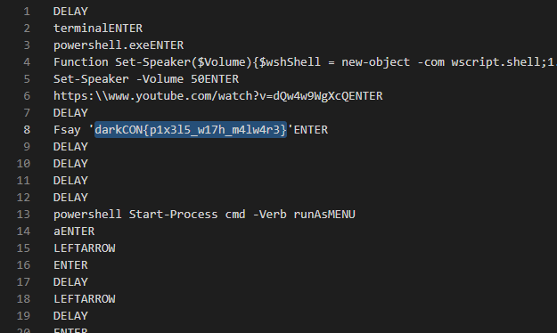

# Pixelify - DarkCON 2021

---

Category: Misc
Points: 474
Solves: 42
Solved by: RxThorn

---

```
Pixels don't reveal secrets, or do they?
Hint : The original file name is inject.bin
```

## Solution

### Analysis

We were given a Python script and a picture.

First of all we analyzed the script `picmaker.py`. It mainly does three things:

1. Convert a file content to base64
2. Split every byte of the base64 string into 4 parts
3. Associate a color to each of the possible couples of bits (00,01,10,11)
4. Render a file containing pixels with all these colors

Indeed every character of the string is represented with a byte, 8 bits, and using the bitwise operations (`right shift` and `logical and`), it created four intervals of two bits.

```py3
(ord(i)>>6)&3
```

Since 2^2=4, the possible values of each couple could be only four and the script associated a color to each value.

```py3
colours = [
    (255, 0, 0),
    (0, 0, 255),
    (0, 128, 0),
    (255, 255, 0)
]
```

### Part 1

Our exploit simply did the opposite thing:

1. bit by bit it calculated the bit couple associated with that color
2. put together four couples at a time
3. translated that bytes array into a string
4. converted the string from base64 and saved it to a file

### Part 2

At that point we only had a file with no clue about what it was: a few printable characters and no magic number.

Luckily the hint helped us, telling us that the file's original name was `inject.bin`.

After searching that name on the internet we found out that it was a `rubber ducky`'s binary file, easily reversible with tools like `https://ducktoolkit.com/decoder/`.



Indeed, in the reversed file we found a string with the flag: `darkCON{p1x3l5_w17h_m4lw4r3}`
