# Happy New Year (parts 1, 2, 3)
Category: Pwn

Points: 504 - 556 - 650

Solved by: drw0if - kusky

## Problem

### Part 1:

The new year is approaching, so kksctf offers you to play secret Santa. The rules are simple, you go in, choose who to send your greetings to and wait for someone to congratulate you.

Note: the recipient doesn't know who send the email. Share a little happiness with this app. Good luck!

Oh, Yes, I almost forgot, they brought you some big gift.

nc tasks.kksctf.ru 30040

### Part 2:

Will you be able to become the main Santa?

### Part 3:

Have you found the root for all the presents?

## Writeup

### Part 1:
The challenge comes with a 64 bit stripped ELF [file](gift).

Before reversing the binary let's use the netcat service to have an idea about the software:

We are greeted with a simple menu with 3 choices:


Let's register since we don't have an account

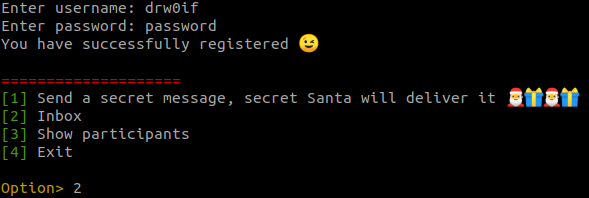

Now we have a new menu with 4 choices. Let's try all of them:


Seems that there is nothing more we can do here.

Let's start with the reverse. We opened it in Ghidra and as always if the binary is stripped we can find the main function from the entry point since a pointer to the main function is the first argument passed to `__libc_start_main`.


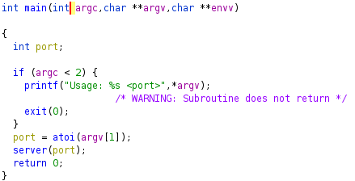

Main function is just used to check if a parameter is passed to the program, then attempts to convert the parameter into an integer and passes it to a function. This function tries to open a socket connection on the port specified as argument.

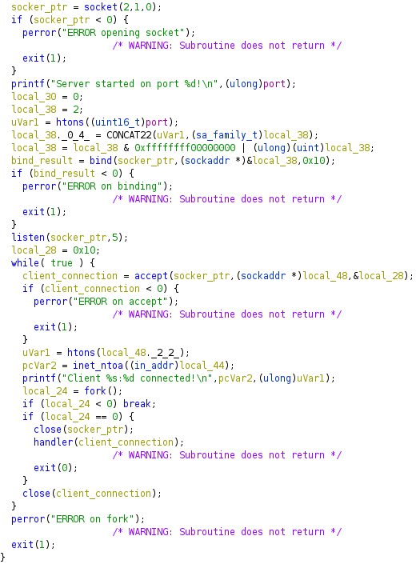

Let's have a deep dive into the connection handler function:

The first block is used to handle the menu and the signup/signin phase


The function that handles `show participant` function is a wrapper to another function which execute sqlite query:

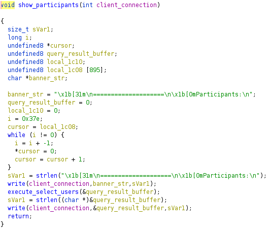
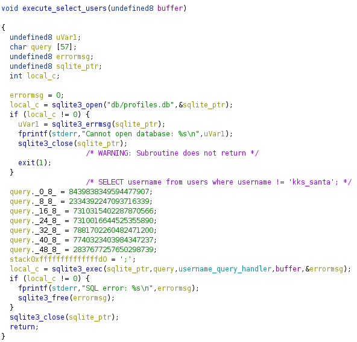

The query isn't treated as a stirng by Ghidra for an unknown reaso but forcing it to treat the byte sequence as a CterminatedString the result is
```SELECT username from users where username != 'kks_santa';```

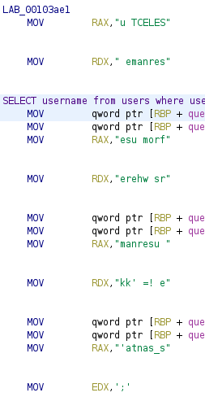

This is a simple select query so not enough to discuss.

Let's have a look at the signup handler:

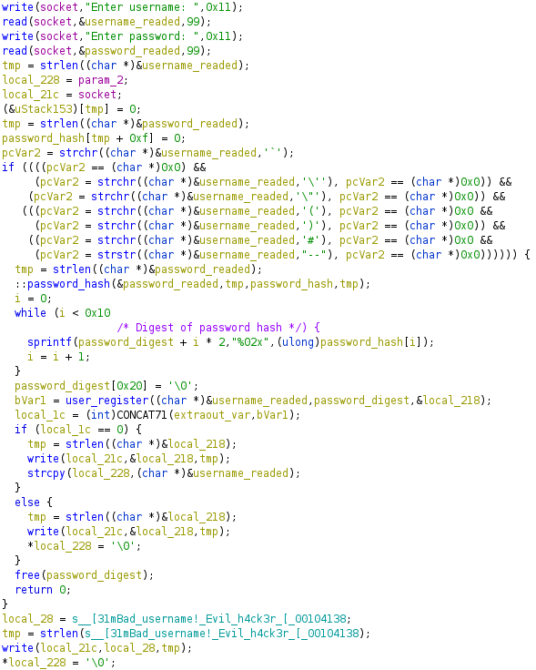

The username and the password are requested. The username is passed via a simple series of check that prevents sqlinjections since if the checks fails `Bad username! Evil h4ck3r` is printed.

The password is passed in a complex function that I assumed to be an hash algorithm since at the end an hex digest is built. At the end username and password are passed to a function which is used to craft an sql query to insert the new record.

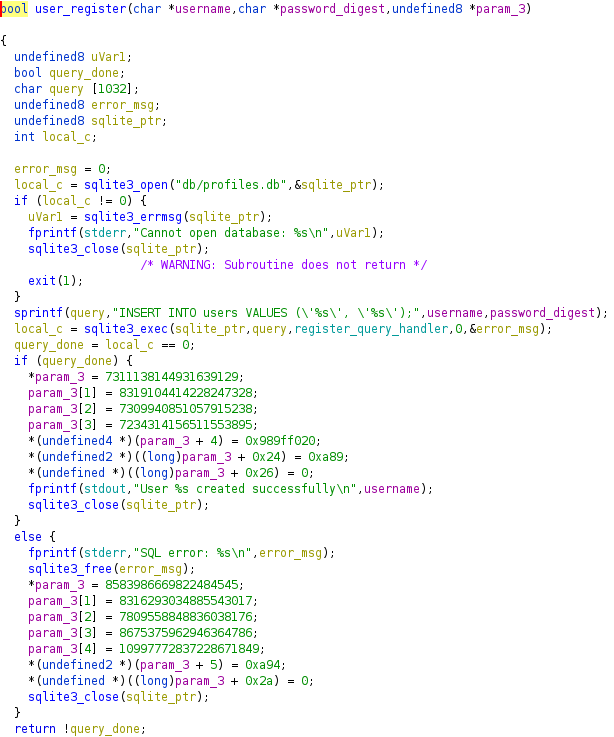

Here again some strings are treated as long value but what is important is that nothing seems to be broken here. Almost the same procedure is built around the login functionality.

The juicy part comes with the second block:


First things first the code does a check on the username. If `kks_santa` has logged in the loop breaks and we can go into the third block of code otherwise we reach the user private menu. Without discussing too much let's focus on the vulnerable part since we already faced most of the reversing problem we encountered during this long reverse.

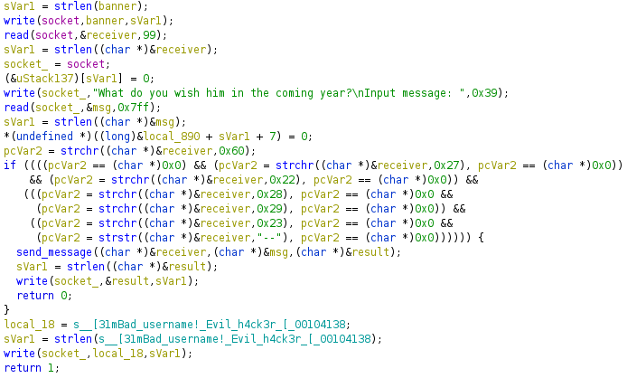

The send message procedure asks us for a receiver and a message. The receiver is passed via the same checks username is passed into and then the insert query is made.

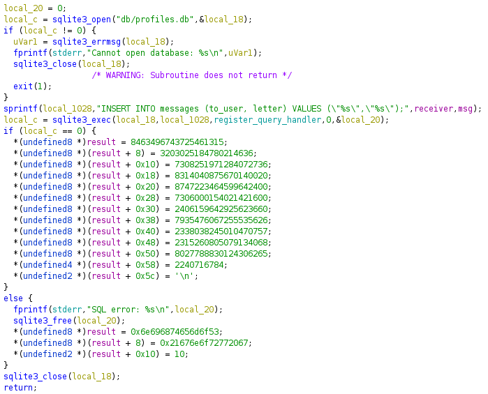

The query is simply `INSERT INTO messages(to_user, letter) VALUES (%s, %s)` and then the values are interpolated. The problem is that only the username is checked. We can make an sqli to take control over the database.

Let's think about a way to gain `kks_santa` credentials: we can steal the hash but we should also reverse it and we don't know the algorithm used.. But we can also overwrite the santa hash wit our own value and use the same password!

Let's craft the payloads:
```
"); INSERT INTO messages(to_user, letter) SELECT "drw0if", password FROM users WHERE username="drw0if"; -- #
```
We can use this payload to stel our hash and exfiltrate it from the inbox functionality. Let's try it:


Our hash is: `5f4dcc3b5aa765d61d8327deb882cf99`

Let's use it to replace everyone's hash:
```
"); UPDATE users SET password="5f4dcc3b5aa765d61d8327deb882cf99"; -- #
```


Now we should be able to login as `kks_santa` with password `password`
Let's try it:


We also gained the first flag since in the third block of the handler code a function is called to retrieve a key from the database and display it.

### Part 2:

The third block of code starts with the first flag print. then a new menu is printed with some new feature for example the "show all messages" (it's a scam, lol) and `relax`.

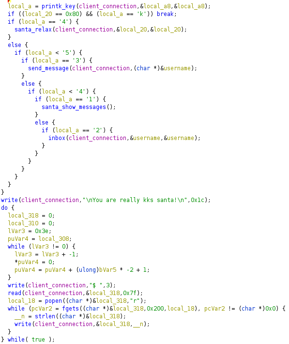

The loop breaks when local_20 is 0x80 and local_a is 'k'. local_a is the "variable" that stores our choice, local_20 is never used here but is passed to the relax option handler as reference.


This funcionality increments the "beer" counter and if it reaches some values we are greeted with different comments. Let's increment that counter with a simple copy paste of `python -c "print '4\n'*0x80"` output.

Last part of the handler code is a basic shell built upon `popen` function. So we gained a partial RCE.

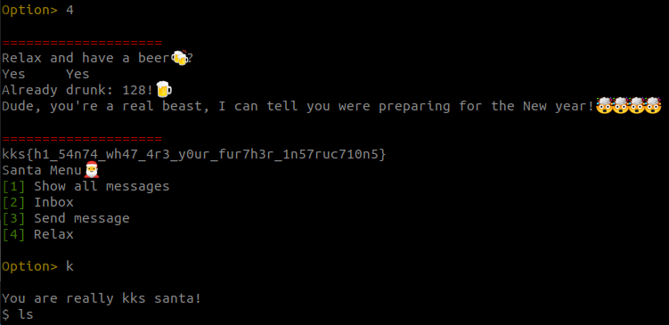

Let's have a loop at the suid files:
```bash
$ find / -perm /4000
/usr/bin/newgrp
/usr/bin/passwd
/usr/bin/gpasswd
/usr/bin/su
/usr/bin/chsh
/usr/bin/chfn
/usr/bin/mount
/usr/bin/umount
/home/santa/secret
```

No privesc seems to be available here but the last file is interesting. Let's execute it:

```bash
$ /home/santa/secret
This incident will be sent to the main Santa. I'll say you've been bad this year.
```

Let's exfiltrate it via base64 encoding:

```bash
cat /home/santa/secret | base64
```

The file is provided by this repo. Opening it into Ghidra it is really easy to understand:

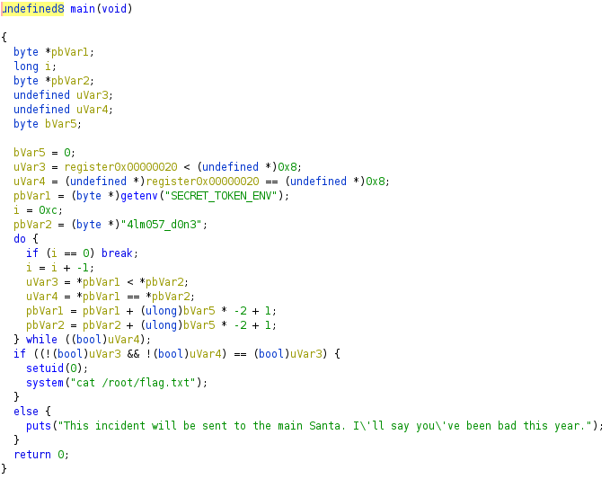

So all we need to do is to execute the binary with the variable set:

```bash
$ SECRET_TOKEN_ENV="4lm057_d0n3" /home/santa/secret
kks{w0w_y0u_4r3_7h3_r007_s4n74_6u7_did_y0u_74k3_411_7h3_pr353n75}$
```

### Part 3:

Let's have a quick look at all the other files with "find".
The last one listed seems to be coherent with the challenge description

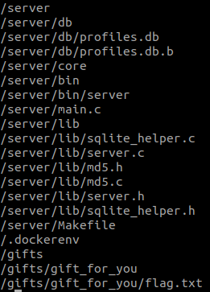

```bash
$ cat /gifts/gift_for_you/flag.txt
:,5[m9mTre9mT)]9iP/19mT6S9iOi5:2NES>&%1s9mT)\=aF+c:23dT9giK;:01SE:3pDr:3p&h:K1A39mU;q:/kD59mT5a=__(p:3pP/:I.-,$
```

I got stuck here for a while since `kusky` started working with me on this challenge. Using cyberchef he decrypted it with the following recipe:


In the end it was a wonderful challenge and we learnt a lot, starting from sqlite3 syntax to encoding techniques to binary exfiltration in a pseudo shell.

PS. we dumped the full /server directory except from database so if you want to make your attempts feel free to use this repo.